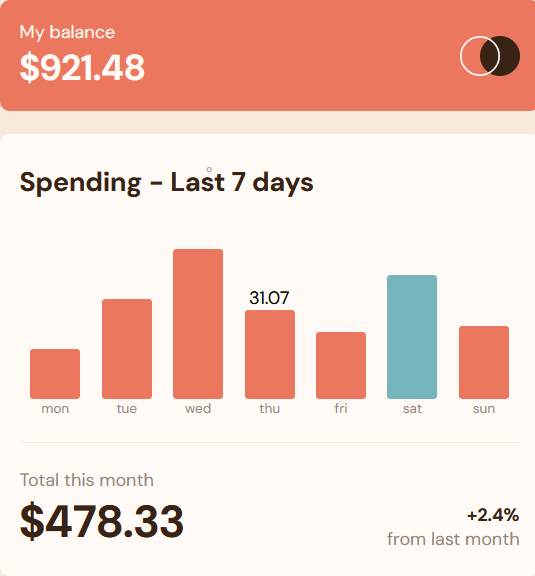

# Frontend Mentor - Expenses chart component solution

This is a solution to the [Expenses chart component challenge on Frontend Mentor](https://www.frontendmentor.io/challenges/expenses-chart-component-e7yJBUdjwt). Frontend Mentor challenges help you improve your coding skills by building realistic projects. 

## Table of contents

- [Overview](#overview)
  - [The challenge](#the-challenge)
  - [Screenshot](#screenshot)
  - [Links](#links)
- [My process](#my-process)
  - [Built with](#built-with)
  - [What I learned](#what-i-learned)
    - [Javascript SVG Shape Objects](#javascript-svg-shape-objects)
  - [Continued development](#continued-development)
  - [Useful resources](#useful-resources)
- [Author](#author)
- [Acknowledgments](#acknowledgments)

## Overview

### The challenge

Users should be able to:

- View the bar chart and hover over the individual bars to see the correct amounts for each day
- See the current day’s bar highlighted in a different colour to the other bars
- View the optimal layout for the content depending on their device’s screen size
- See hover states for all interactive elements on the page

- **Bonus**: Use the JSON data file provided to dynamically size the bars on the chart

### Screenshot



### Links

- [Solution Code](https://github.com/oasfour/frontend-mentor-challenges/tree/main/expenses-chart)
- [Live Site](https://oasfour.github.io/frontend-mentor-challenges/expenses-chart/)

## My process

### Built with

- Semantic HTML5 markup
- CSS Grid
- Javascript - JSON fetch, event handlers
- Mobile-first workflow

### What I learned

#### Javascript SVG Shape Objects
**Feature**  
The bars in the chart are Scalable Vector Graphics (SVG) dynamically generated based on the JSON data.

**Issue**  
Setting up an XML element using just the Element creation method resulted in externally-terminated shapes (\<rect><\rect>) instead of self-terminating ones (\<rect />). These would not display in the browser.

**Workaround**  
An alternative/workaround that was put to use was to directly set the innerHTML on the container (span) element directly as a string.

```js
let container = document.createElement("span");
container.innerHTML = '<svg width="50" height="150" xmlns="http://www.w3.org/2000/svg"><rect width="50" height="150" rx="3" ry="3" /></svg>';

```

**Solution**  
While HTML elements (such as span) are created as elements, the XML elements (such as SVG, Rect) need to be created using Element Namespaces.

```js
let svgns = "http://www.w3.org/2000/svg";
let yourRectange = document.createElementNS(svgns,"rect");
let yourGraphic = document.createElementNS(svgns,"svg");
let container = document.createElement("span"); 
/* Call setAttribute() on each to set attributes.
 * Link them together... */
yourGraphic.appendChild(myRectange);
container.appendChild(yourGraphic);
/* This will give you an HTML object (container)
 * which you can similarly append as a child
 * to your target parent element */
```

### Continued development

- _Learning_: ASP.NET, Razor, Blazor
- _Practice_: C#, CSS3, Saas
- _Future_: React.js, Next.js

## Author

- Website - [@omar.asfour.ca](https://omar.asfour.ca)
- Github - [@oasfour](https://github.com/oasfour)
- Frontend Mentor - [@oasfour](https://www.frontendmentor.io/profile/oasfour)
- Twitter - [@OmarAsfourE3](https://www.twitter.com/OmarAsfourE3)