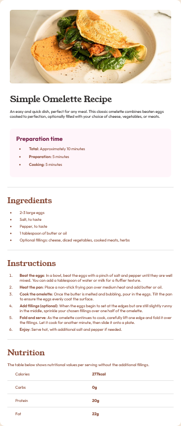

# Frontend Mentor - Recipe page

This is a solution to the [Recipe page challenge on Frontend Mentor](https://www.frontendmentor.io/challenges/recipe-page-KiTsR8QQKm). Frontend Mentor challenges help you improve your coding skills by building realistic projects. 

## Table of contents

- [Overview](#overview)
  - [The challenge](#the-challenge)
  - [Screenshot](#screenshot)
  - [Links](#links)
- [My process](#my-process)
  - [Built with](#built-with)
  - [Semantic Markup](#semantic-markup)
  - [Mobile-First Layout](#mobile-first-layout)
  - [Test Process](#test-process)  
  - [Continued development](#continued-development)
  - [Useful resources](#useful-resources)
- [Author](#author)
- [Acknowledgments](#acknowledgments)

## Overview

### Screenshot



### Links

- [Solution](https://github.com/oasfour/frontend-mentor-challenges/tree/main/recipe-page)
- [Live Site](https://oasfour.github.io/frontend-mentor-challenges/recipe-page)

## My process

### Built with

- HTML5
- CSS3
- Mobile-first
- Responsive
- Print-friendly

### Semantic Markup

The recipe was divided into in semantic sections:

```html
<article class="recipecard"> <!-- Recipe Card as a whole -->
  <figure class="recipephoto" /> <!-- Recipe Photo -->
  <header class="recipeintro" /> <!-- Recipe Intro -->
  <section class="recipeprep" /> <!-- Special Section -->
  <section class="recipedetail"/ > <!-- General Section -->
</article>
```

For the nutritional information, being straight forward data table we opted for a simple ```<table>``` element.

```html
<table class="nutrition-table">
  <tbody class="nutrition-facts">
    <tr class="nutrition-fact">
       <td class="nutrition-attribute" />
       <td class="nutrition-value" />
    </tr>
  </tbody>
</table>
```

### Mobile-First Layout
Since the design layouts have the figure/image at 656 pixels, with a 40 pixel padding (both left and right), we made that combined width (756 pixels) the threshold for the mobile-first layout.

- Mobile: 
  - Viewport < 756px
  - No padding around figure
  - Scale image up to 656px max [no minimum]
- Larger:
  - Viewport >= 736px
  - Add padding around figure (40px)
  - Maintain Image at 656px max
- Print:
  - Omit figure/image (save paper)
  - Collapse whitespace (save paper)

### Test Process
Tested various screen widths, both portrait and landscape to simulate various desktop and mobile device sizes.
- Per-Design: >= 265 pixels
  - Performs as expected at or above 265 pixels.
- Break-point: < 265 pixels
  - Content data "Approximately" in the "Preparation time" section starts to bleed out of its colored boundary box.

### What I learned

- How to select directly select middle children (neither first nor last) of a parent element.

```CSS
ul li:not(:first-child):not(:last-child)
```

### Continued development

- _Learning_: ASP.NET, Razor, Blazor
- _Practice_: C#, CSS3, Saas, jQuery
- _Future_: React.js, Next.js, Angular

## Author

- Website - [@omar.asfour.ca](https://omar.asfour.ca)
- Github - [@oasfour](https://github.com/oasfour)
- Frontend Mentor - [@oasfour](https://www.frontendmentor.io/profile/oasfour)
- Twitter - [@OmarAsfourE3](https://www.twitter.com/OmarAsfourE3)